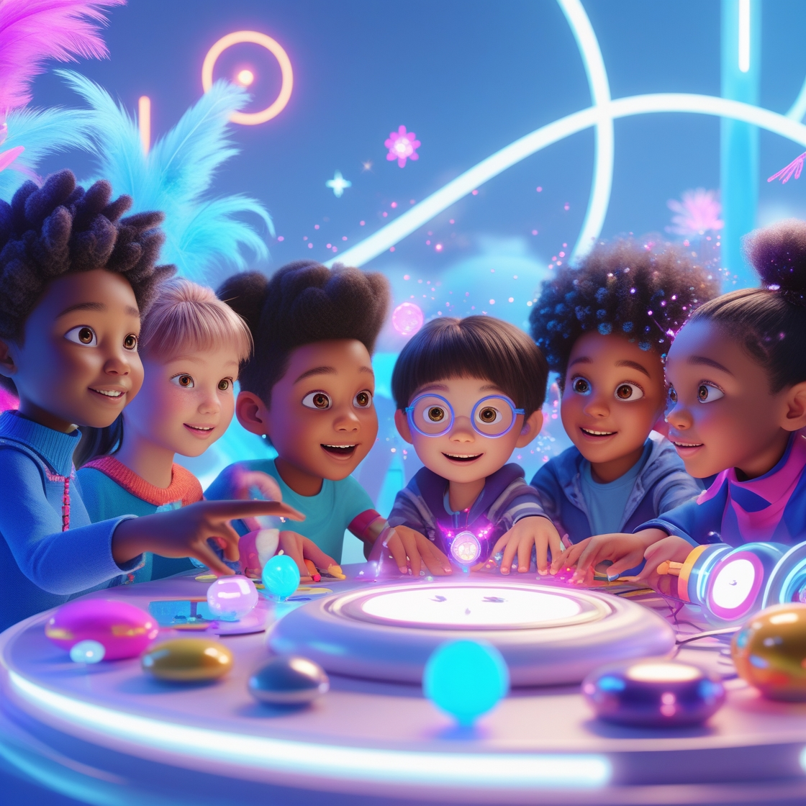
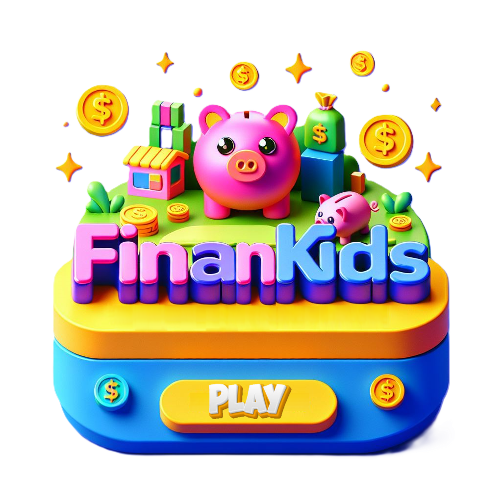
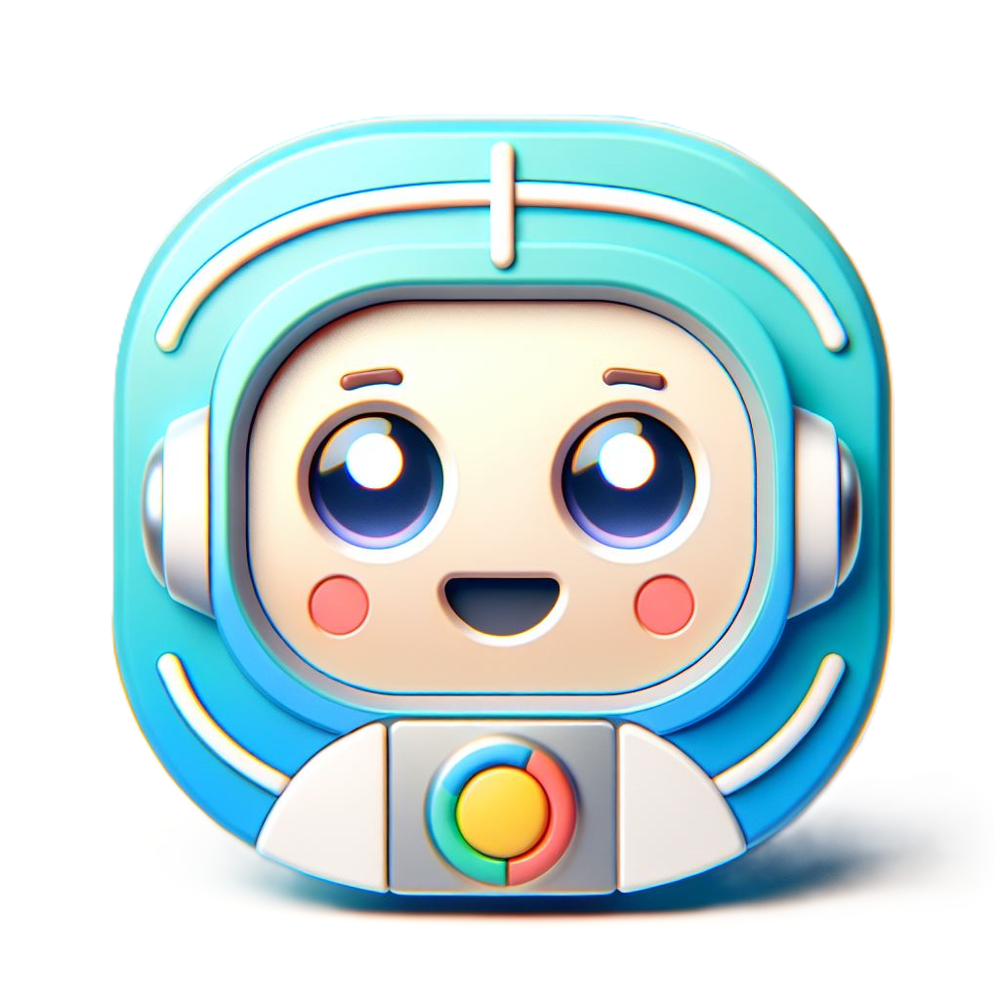
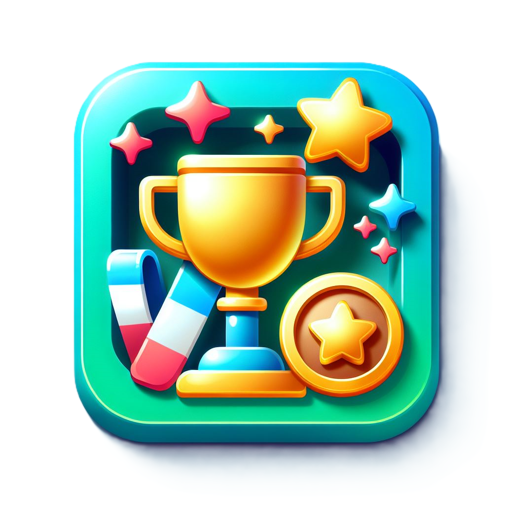

# Desafio CAIXA - Criando Impacto Social com IA

  

  

 > ℹ️ **NOTE:** Este é o repositório desenvolvido como parte da jornada do Bootcamp CAIXA – IA Generativa com Microsoft Copilot.

## Projeto Desenvolvido: 

## FinanKids – Educação Financeira Divertida para Crianças

O FinanKids é uma ideia que nasceu com uma missão: revolucionar a forma como as crianças aprendem sobre dinheiro e finanças. 

Com muita criatividade e tecnologia de ponta, foi idealizada uma plataforma que une aprendizado e diversão em um só lugar!

A ideia é simples: tornar temas financeiros, que às vezes parecem difíceis ou chatos, em algo lúdico, interativo e cheio de magia.

Com jogos interativos, vídeos educativos e assistentes virtuais, o FinanKids quer, no futuro, ser uma plataforma que une aprendizado e diversão, mostrando que aprender sobre dinheiro pode ser tão empolgante quanto brincar!

   

  

## ✨ Objetivos do Projeto

o FinanKids possui um enorme potencial de impacto social transformador ao democratizar o acesso à educação financeira.

Além de ensinar sobre dinheiro, o FinanKids quer fazer a diferença na vida das crianças e de suas famílias:

-	Ensina a importância de economizar e planejar.
-	Ajuda a criar hábitos financeiros saudáveis desde cedo.
-	Promove o aprendizado de forma divertida e interativa.
-	Conecta famílias no aprendizado, incentivando hábitos positivos juntos.
-	Reduz desigualdades no acesso à educação financeira.
-	Prepara os pequenos para tomar decisões financeiras conscientes no futuro.
  
Tudo isso enquanto se divertem e aprendem valores como responsabilidade, planejamento e generosidade. 

## 💻 Tecnologias utilizadas no projeto

- [ChatGPT](https://chat.openai.com/) 
- [Microsoft Copilot]
- [DALL·E](https://openai.com/dall-e)
- [Leonardo.AI](https://https//app.leonardo.ai/)
- [Openart.ai](https://openart.ai/home)
- [Capcut](https://www.capcut.com/pt-br/)

## 📚 Materiais Produzidos

-	[Descrição detalhada do projeto:](https://github.com/Cecima1/Projeto-CAIXA/raw/main/Projeto_Final/2.0_Projeto.pdf) Um documento que explora todas as etapas e principais características da ideia.
  
-	[Apresentação visual:](https://github.com/Cecima1/Projeto-CAIXA/raw/main/Projeto_Final/1_FinanKids_Apresentacao.pdf) Slides caprichados que sintetizam os pontos mais importantes do projeto de forma clara e atrativa.
  
-	Prototipagem de funcionalidades: Exemplos como [Jogos Interativos](https://github.com/Cecima1/Projeto-CAIXA/raw/main/Projeto_Final/2.1_Jogos_Interativos.pdf), [Vídeos Educativos](https://github.com/Cecima1/Projeto-CAIXA/raw/main/Projeto_Final/2.3_V%C3%ADdeo%20Educativo.mp4) e [Assistentes Virtuais](https://github.com/Cecima1/Projeto-CAIXA/raw/main/Projeto_Final/2.2_Assistentes_Virtuais.pdf), já desenhados para mostrar o potencial da plataforma.

-	[Página web fictícia:](https://github.com/Cecima1/Projeto-CAIXA/raw/main/Projeto_Final/3_P%C3%A1gina_Web_Final.html) Uma simulação do que seria a experiência do usuário ao acessar a plataforma, trazendo o conceito à vida

  
  
  
  

## 👨‍💻 ~~Expert~~ Inicinate Entusiasta

    Cecília Martins de Almeida 
    <a href="https://github.com/Cecima1">GitHub</a> | 
    <a href="https://www.linkedin.com/in/cecilia-martins-de-almeida-905112345/">LinkedIn</a>

---

⌨️ com MUITO 💜 por [Cecília Martins](https://github.com/Cecima1)

